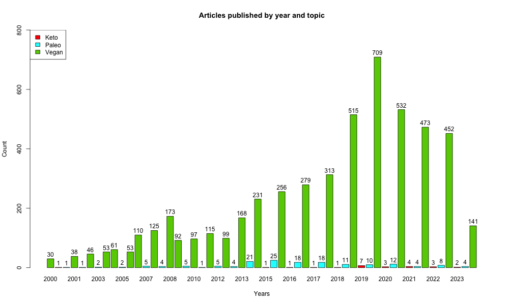
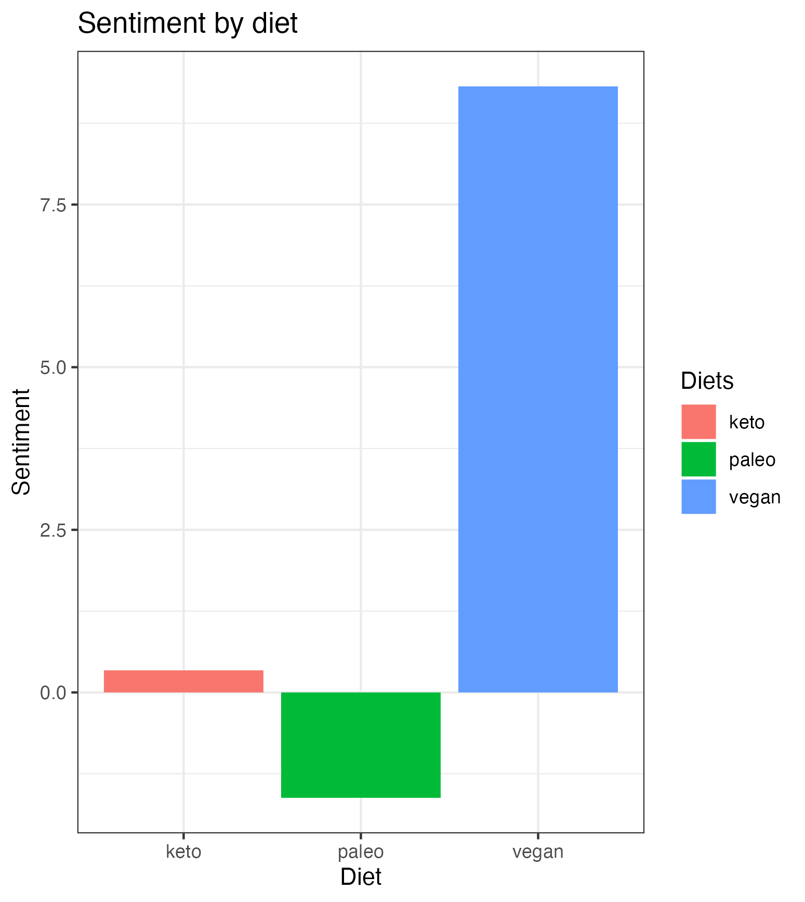

```{r setup, include=FALSE}
knitr::opts_chunk$set(
  echo = TRUE, 
  warning = FALSE, 
  message = FALSE, 
  dpi = 300)
```

# Introduction

For Class Exercise 2 we scraped articles from [the Guardian magazine](https://www.theguardian.com/international) about three diets of our own interest to see thends in populaity for each of them.  

## Data Collection

To gather data on articles related to specific diets, we scraped articles from The Guardian website that contained keywords "vegan", "paleo", or "keto" from the years 2000 to 2023. The data manipulation and cleaning was performed using R scripts 01-03 in relevant folder.


## Data visualization 

To gain insights into the popularity of these diets over time, we performed an analysis (R script 04) to visualize the number of articles related to each diet that were published in The Guardian from 2000 to 2023. This analysis helped us better understand the trends and changes in the discourse around these diets.

### Arcticles published by topic


Based on the data presented in the barplot, it is clear that the vegan diet has been a popular topic in the Guardian magazine for the past two decades. With a total of 51,611 articles about veganism, it has received significantly more coverage than the paleo and keto diets combined. The paleo diet received only 1,611 articles during the same time period, while the keto diet received even less coverage with only 241 articles. 


### Articles published by year and topic



Upon analyzing the trend between the years, it can be observed that the distribution of articles for the vegan diet is left-skewed, with the peak number of articles occurring in 2019. This indicates that the vegan diet has gained significant attention and interest in recent years.

On the other hand, the keto diet remained unpopular for discussion in the Guardian magazine, with an average number of articles compared to the other two diets.

Overall, these findings suggest that the vegan diet has been the most prominent dietary trend in the Guardian magazine over the past two decades, with a growing interest in recent years. The paleo diet had a peak in 2015, while the keto diet remained relatively unpopular in the magazine's coverage.

### Sentiment analysis 



Sure, based on the sentiment analysis of the articles published in the Guardian magazine, it can be observed that the vegan diet received the most positive sentiment, indicating a generally favorable view of the diet. The paleo diet received mixed sentiment, suggesting that the opinions regarding this diet are divided. In contrast, the sentiment analysis for the keto diet showed a majority of negative sentiment, indicating that it has generally been viewed in a negative light by the Guardian's readership. These findings suggest that the vegan diet has received the most attention and positive sentiment among the three diets in the Guardian magazine.

## Conclusion

 Based on the analysis of the data presented, we can conclude that the vegan diet has been the most prominently covered and positively received diet in the Guardian magazine over the past two decades. The paleo diet received a moderate amount of coverage and a mixed sentiment, suggesting a more divided opinion. The keto diet received the least amount of coverage and predominantly negative sentiment. However, it is important to note that this analysis is based on a limited dataset, and may not be representative of the overall sentiment towards these diets among the general population or even among the Guardian's readership as a whole. Therefore, it is necessary to interpret these findings with caution and keep in mind the limitations of this analysis.


