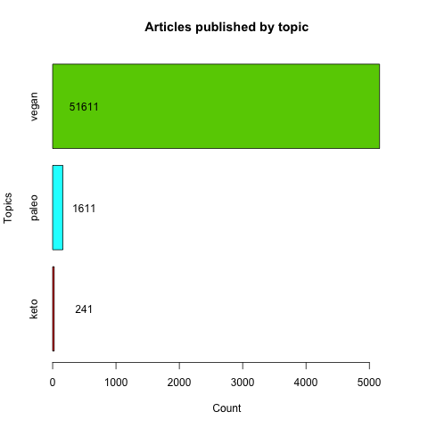

```{r setup, include=FALSE}
knitr::opts_chunk$set(
  echo = TRUE, 
  warning = FALSE, 
  message = FALSE, 
  dpi = 300)
```

# Introduction

For Class Exercise 2 we scraped articles from [the Guardian magazine](https://www.theguardian.com/international) about three diets of our own interest to see thends in populaity for each of them.  

## Data Collection

To gather data on articles related to specific diets, we scraped articles from The Guardian website that contained keywords "vegan", "paleo", or "keto" from the years 2000 to 2023. The data manipulation and cleaning was performed using R scripts 01-03 in relevant folder.


## Data visualization 

To gain insights into the popularity of these diets over time, we performed an analysis (R script 04) to visualize the number of articles related to each diet that were published in The Guardian from 2000 to 2023. This analysis helped us better understand the trends and changes in the discourse around these diets.

### Arcticles published by topic



Based on the data presented in the barplot, it is clear that the vegan diet has been a popular topic in the Guardian magazine for the past two decades. With a total of 51,611 articles about veganism, it has received significantly more coverage than the paleo and keto diets combined. The paleo diet received only 1,611 articles during the same time period, while the keto diet received even less coverage with only 241 articles. 

